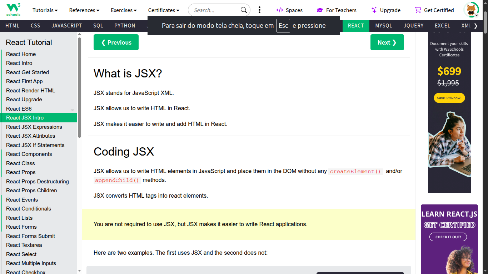

# Projeto de Estudos React - W3Schools  
 
 
 
  

This repository contains implementations and examples developed during the study of React using the material provided by W3Schools. The focus is on the conceptual understanding of components, properties, and states.

The project is developed for academic purposes, aiming to document learning and provide support for future studies in modern applications with React and JavaScript.

